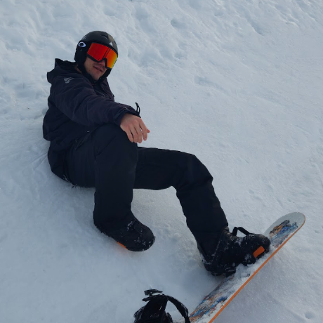

<section class="bio">
    
    

        Hello! This is Juan :)
    

    

        Genuinly interested in AI research and the engineering aspect of it.
        On my way to making GPUs go brrr!
        Was very excited that I got access to a cluster with lots of gpus to run my thesis experiments.
        I do like multimodal models and LLMs in general.
        I'm tweaking LLMs at the moment: did some post-training with GRPO and now exploration of the data manifold of an LLM via sampling.
    

    

        Working on my AI Systems MSc at the University of Trento.
    

    

        Experience at NEURA Robotics and COVAP.
    

</section>


<section id="publications">
    <h2>Selected Publications</h2>
    <ul>
        <li>
            <strong>Paper Title 1</strong> (2023) 
            Authors: {{ site.title }}, Co-author 1, Co-author 2 
            <em>Conference/Journal Name</em> 
            <a href="#">[PDF]</a> <a href="#">[Code]</a> <a href="#">[Project]</a>
        </li>
        <li>
            <strong>Paper Title 2</strong> (2022) 
            Authors: {{ site.title }}, Co-author 1, Co-author 2 
            <em>Conference/Journal Name</em> 
            <a href="#">[PDF]</a> <a href="#">[Code]</a> <a href="#">[Project]</a>
        </li>
    </ul>
</section>


<section id="projects">
    <h2>Projects</h2>
    <ul class="project-list">
        <li>
            <strong><a href="/blog/2024/11/30/alpha-clip-study/">Alpha-CLIP: A Breakthrough in Region-Focused AI Vision</a></strong> - A literature review exploring Alpha-CLIP's capabilities in region-focused AI vision and proposing enhancements for improved performance.
        </li>
        <li>
            <strong><a href="/blog/2024/03/01/test-time-adaptation/">Test-Time Adaptation for Vision-Language Models</a></strong> - Analysis and improvement of efficient adaptation techniques for vision models facing distribution shifts. Benchmarked failure cases and implemented waiting list mechanism to improve performance on non-IID data streams.
        </li>
        <li>
            <strong><a href="/blog/2022/05/01/bsc-thesis-robot-grasping/">6DoF Robot Grasping with TIAGo</a></strong> - My BSc thesis project on teaching robots to grasp objects using deep learning and computer vision. Developed for the LASR team and RoboCup competitions.
        </li>
    </ul>
</section>

<section id="contact">
    <h2>Contact</h2>
    
Email: <a href="mailto:{{ site.email }}">{{ site.email }}</a>

    

        <a href="https://github.com/{{ site.github_username }}" target="_blank"><i class="fab fa-github"></i>GitHub</a>
        <a href="https://linkedin.com/in/{{ site.linkedin_username }}" target="_blank"><i class="fab fa-linkedin"></i>LinkedIn</a>
        <!-- <a href="https://twitter.com/{{ site.twitter_username }}" target="_blank"><i class="fab fa-twitter"></i>Twitter</a>
        <a href="https://scholar.google.com/citations?user={{ site.google_scholar }}" target="_blank"><i class="fas fa-graduation-cap"></i>Google Scholar</a> -->
    

</section> 